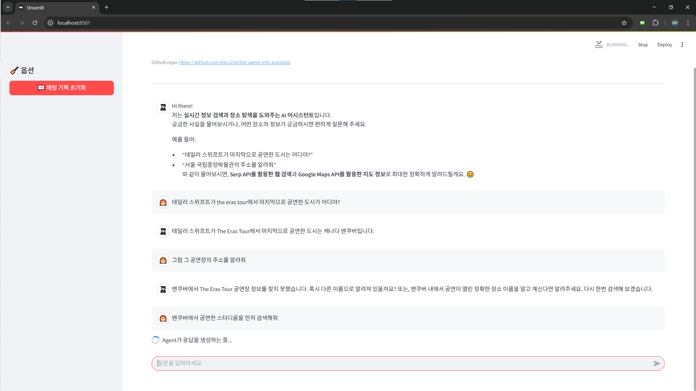
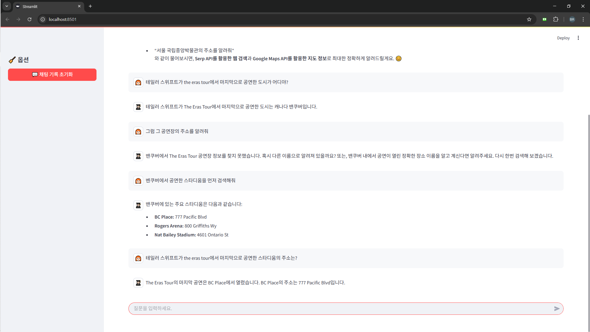
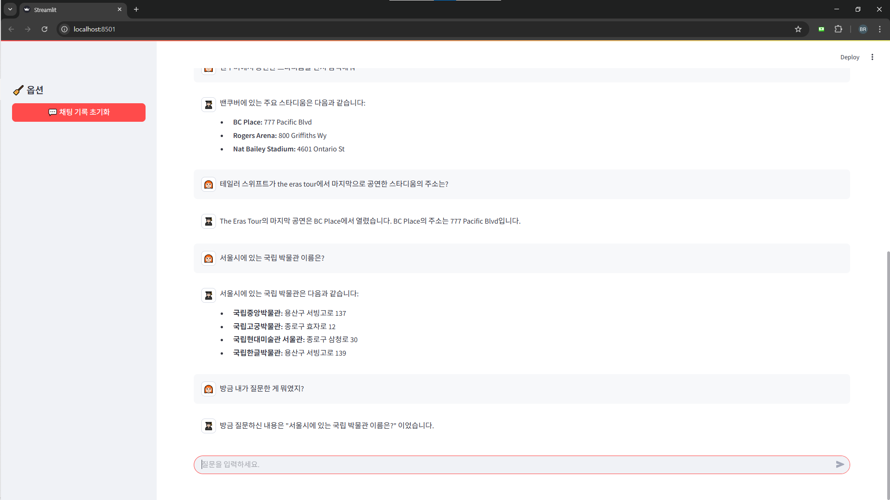

# (sample) 실시간 정보 검색 및 장소 탐색 AI Agent🐱‍🏍

> 이 브랜치는 LangGraph의 고수준 프리셋인 `create_react_agent()`를 기반으로 구현된 **샘플 서비스 버전**.  
> 메인 브랜치에서는 추후 **사용자 정의 LangGraph (StateGraph + node 구성)** 기반으로 리팩토링 및 확장할 예정.

<br>

---

## 🐱‍💻 프로젝트 개요

**사용자의 질문에 실시간 웹 검색과 장소 정보를 활용해 답변하는 멀티턴 AI 에이전트**   
- 사용자는 자연어로 질문을 입력할 수 있으며,  
- 시스템은 필요 시 외부 API를 활용하여 정보를 수집하고,  
- Gemini 모델 기반 LLM이 종합적인 답변을 생성함  

<br>

---
## 🐱‍🐉 사용 기술 스택

| 영역 | 사용 기술 |
|------|-----------|
| LLM 모델 | Google Gemini (`gemini-2.0-flash`) via `langchain_google_genai` |
| 프레임워크 | `LangChain`, `LangGraph` (`create_react_agent`) |
| 프론트엔드 | `Streamlit` |
| 외부 도구 | `SerpAPI`, `Google Places API` |
| 메시지 포맷 | `langchain_core.messages.HumanMessage` / `AIMessage` |

<br>

---
## 🐱‍👓 주요 기능

### 1. **자연어 정보 검색**
- 예: `"테일러 스위프트 마지막 공연 도시 알려줘"`  
- → SerpAPI를 통해 최신 웹 검색 결과 수집  
- → Gemini 모델이 종합적으로 응답 생성

### 2. **장소 정보 탐색**
- 예: `"BC 플레이스 경기장 주소 알려줘"`  
- → Google Places API를 통해 정확한 위치, 전화번호, 웹사이트 등 조회 가능

### 3. **멀티턴 대화 지원**
- `HumanMessage`와 `AIMessage`를 기반으로 LangChain의 대화 context를 구성
- 이전 대화 내용을 기억하여 일관성 있는 응답 생성

### 4. **Streamlit UI**
- 사용자 친화적인 채팅 인터페이스 제공
- 채팅 기록 시각화, 초기화 버튼, 반응형 디자인 포함

<br>

---
## 🐱‍🚀 LangGraph 구조 (샘플 버전)

이 브랜치에서는 LangGraph의 고수준 프리셋인 `create_react_agent()`를 사용하여 다음과 같은 추론 체계를 구성함:

- `agent` → 사용자의 질문 이해 및 도구 사용 결정
- `tool_executor` → 선택된 도구 실행 및 결과 수신
- 결과를 바탕으로 LLM이 최종 응답 생성

> 이 구조는 추후 `StateGraph` + 사용자 정의 `Node`로 리팩토링할 예정임

<br>

---

## 🐱‍👤 프로젝트 구조
```
llm-agent-info-assistant/
│
├── main.py # Streamlit 앱 실행 진입점
├── app/
│ ├── ui.py # Streamlit 채팅 인터페이스
│ ├── agent.py # LangGraph ReAct Agent 실행 로직
│ ├── model.py # Gemini 모델 초기화
│ ├── tools.py # SerpAPI 및 Google Places API 도구 정의
├── prompt/
│ └── say_hi_to_user.py # 첫 인사 프롬프트
```

<br>

---

## 📸 테스트 실행 화면 예시

- 좌측 사이드바에 채팅 기록 초기화 버튼
- Streamlit 기반 채팅 UI 구조

<br>


- 사용자가 연속적인 질의를 통해 “도시 → 공연장 주소”로 대화를 이어감
- SerpAPI와 Google Places API 동작
- **테일러 스위프트 공연 >> 벤쿠버 >> 해당 스타디움 주소**로 검색해야 하는데 **The Eras Tour** 키워드로 공연장 주소를 검색한 문제 발생

<br>


- 하나의 질문에 대해 Serp API와 Google Places API 모두 실행 가능한 그래프 구조

<br>


- 사용자 쿼리에서 키워드를 찾아 검색 후 다양한 장소 반환

<br>


- “방금 내가 질문한 게 뭐였지?”라는 회상 질문에 대해 chat_history 기반으로 LangChain messages를 구성함

<br>

---
## ✅ 향후 계획 (main branch에,,)

- `StateGraph` 기반 커스텀 LangGraph 에이전트로 구조 변경할거임
- 도구 선택 라우터 분기 및 상태 추적 구현
- 사용자 정의 tool 결과 후처리 node 추가
- 응답 explainability 향상 (어떤 툴을 썼는지 명시)
- chunked streamling 방식..을 적용할 수 있다면 해보기

<br><br>


