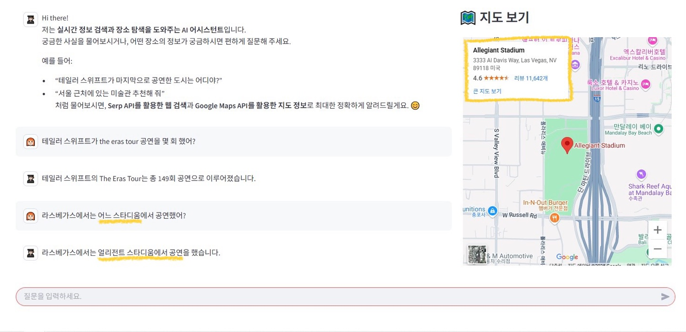

# 🐱‍🏍 실시간 정보 검색 및 장소 탐색을 위한 AI Agent
###### *🐱‍🏍 AI Agent for Real-Time Info & Place Search*

실시간 정보 검색과 장소 탐색을 도와주는 LangGraph 기반 멀티턴 대화형 AI 에이전트입니다.  

사용자의 자연어 질문을 분석하여 **웹 검색 → 장소 탐색 → 응답 생성 → 지도 표시**까지 자동으로 처리합니다.

<br>

## 📌 주요 기능
#### 1. 🔎 실시간 정보 검색 (SerpAPI)
- 뉴스, 인물, 발표 정보 등 실시간 검색
- 검색 실패 시 **최대 3회까지 자동 재검색**
- 검색 쿼리 정제 기능 포함

### 2. 📍 장소 기반 탐색 (Google Places API)
- 공연장, 미술관, 랜드마크 등 장소명을 추출해 주소 검색
- **Google Maps Embed API**로 지도 표시
- 검색 쿼리 정제 기능 포함
      
### 3. 🧠 LLM 기반 자연어 응답
- Gemini LLM 사용 (via `langchain-google-genai`)
- 검색/장소 정보를 반영한 자연스러운 응답 생성
      
### 4. 🧩 LangGraph 기반 멀티턴 제어
- LangGraph로 대화 흐름 구성
- 조건부 분기 (router / 검색 결과 분석 / 재검색 판별)
- StructuredOutputParser로 JSON 기반 응답 처리

<br>

## ⚙️ 기술 스택
| 분류     | 기술                                                            |
| --------- | ------------------------------------------------------------- |
| 프레임워크     | LangGraph + LangChain  |
| LLM       | Google Gemini (gemini-2.0-flash) via `langchain-google-genai` |
| 검색 API    | SerpAPI                                                       |
| 장소 탐색 API | Google Places API (`langchain_community`)                     |
| 프롬프트    | LangChain PromptTemplate, YAML 템플릿 관리   |
| UI     | Streamlit                                                     |
| 빌드 및 패키지 관리   | Poetry                                         |


<br>

## 🛸 그래프 구조


- LangGraph 기반 워크플로우
- 주요 조건부 분기:
  - `route_based_on_keyword` – 검색 vs 장소 vs 바로 응답
  - `conditional_function_from_search_result` – 장소 정보 추가 여부 판단
  - `requery_router` – 검색 결과 부족 시 재검색 루프

<br>

## 🖥️ 예시 화면 및 사용 예

### 입력 예시 1: 정보 검색 (Search Only)
> `"테일러 스위프트가 The Eras Tour 공연을 몇 회 했어?"`

- `search_query_refiner`로 쿼리 정제 → SerpAPI 검색 → 응답 생성


---

### 2. 정보 + 장소 검색 + 지도 표시
> `"라스베가스에서는 어느 스타디움에서 공연했어?"`

- 검색 → 공연장명 추출 → Google Places로 주소 검색  
- 지도에 공연장 위치 표시



---

### 3. 장소 검색 + 지도 표시
> `"어디서 공연을 시작한다고?"`

- 이전 대화에서 언급된 장소(예: 고양종합운동장)를 추론  
- 장소 쿼리 정제 → 주소 검색 → 지도 표시


---

### 4. 즉시 응답
> `"안녕!"`  

- 도구 호출 없이 바로 LLM이 자연어 응답


---

### 🚀 시작 화면


- #1 사용자 입력 창
- #2 지도 임베드 영역
- #3 채팅 기록 초기화 버튼

<br>

## 📂 프로젝트 구조 (간략)

```bash
app/
├── agent/
│   ├── graph.py              # LangGraph 구성
│   ├── nodes.py              # 각 노드 정의
│   ├── state.py              # AgentState 정의
│   ├── model.py              # LLM 정의
├── tools.py                  # 검색 및 장소 도구 정의
├── functions.py              # 자주 사용하는 기능 정의
├── prompt/                   # YAML 프롬프트 템플릿
├── ui.py                     # Streamlit UI
